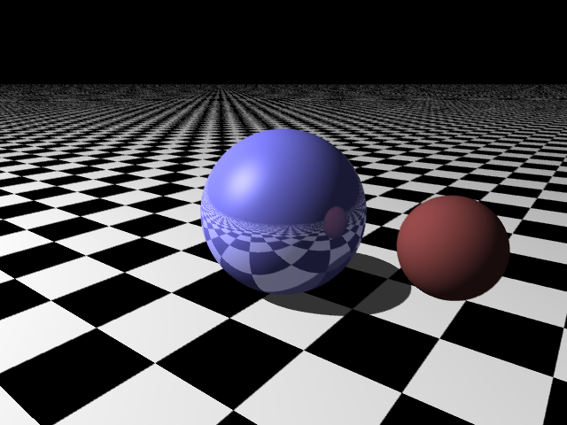

# Raytracing

__This repository aims at simulating the behaviour of light using Helmholtz reciprocity principle.__

A [report](./report.pdf) has been made to explain the code in details.


## Setup environment
To run the code, you can simply do the following:
```Bash
Make
```
A Raytracing.exe will be generated, to get the output image 'anti_aliased.bmp', type:

```Bash
./Raytracing.exe
```

## Results

<table style="width:100%; table-layout:fixed;">
	<tr>
		<td></td>
	</tr>
	<tr>
		<td>  </td>
	</tr>
</table>
